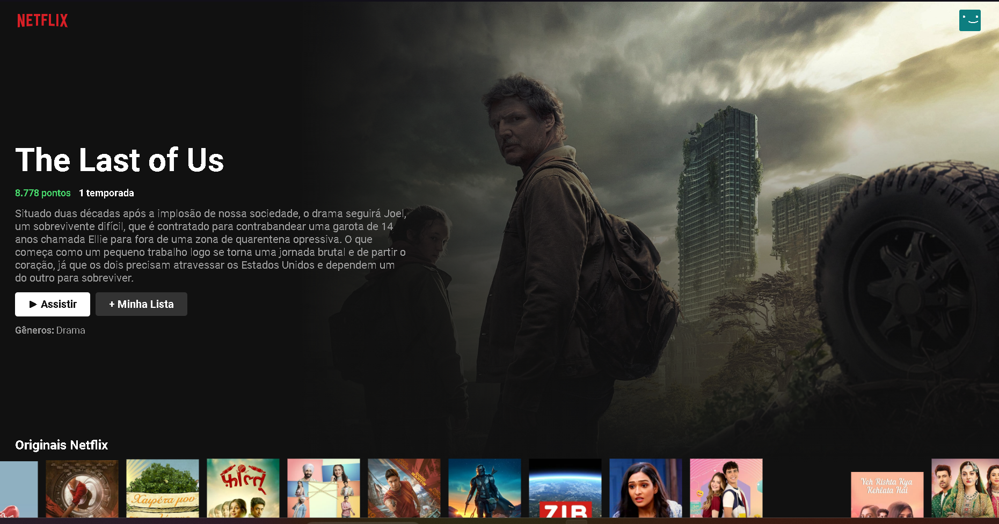

# NETFLIX - REACT

# Sobre o projeto

## Projeto realizado recebendo uma API de filmes, com o layout baseado na NETFLIX.

## Layout principal

 
 


# Tecnologias utilizadas

- JavaScript
- HTML / CSS 

# Como executar o projeto

```bash
# clonar repositório
https://github.com/JGMeneses/Projeto-NETFLIX.git
# executar o comando npm start

```

# Autor

João Victor Gomes Meses
